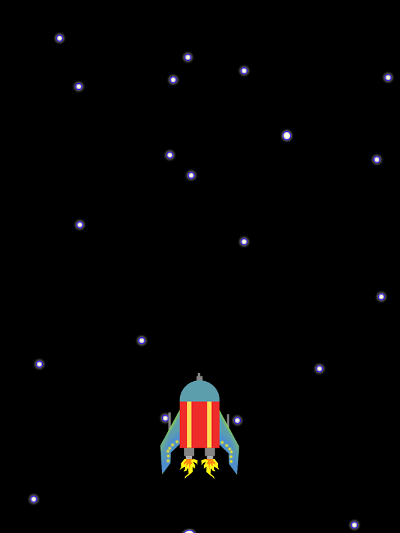
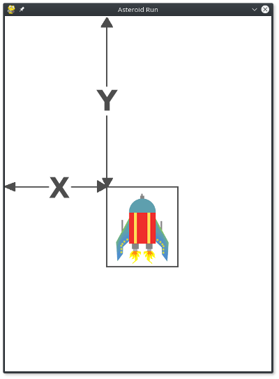

# Introduksjon {.intro}

For å programmere spill i Python, bruker vi et sett av programmerings-biblioteker kalt [PyGame](https://www.pygame.org/news). I denne oppgaven skal vi installere PyGame og tegne et romskip på skjermen.



# Steg 1: Installer PyGame {.activity}

Vi har brukt biblioteker tidligere, f.eks skilpaddebiblioteket, random-biblioteket osv. 

Disse bibliotekene følger med når du installerer Python, men det gjør ikke PyGame. Det må derfor installeres før vi kan bruke det. Den enkleste måten å gjøre dette på er å bruke pakkeverktøyet "pip". 

## Instruksjoner for Windows

Åpne et kommandolinje-vindu og skriv:

```
  python -m pip install pygame --user
```

Hvis du får en feilmelding om at "Finner ingen modul eller program som heter Python" (eller en tekst som likner), se på [denne siden](install_pip.html).

## Instruksjoner for Mac

Åpne Terminal og skriv:

```
  python3 -m pip install pygame --user
```

Forhåpentligvis skal du nå se noen streker fly over terminalvinduet ditt som viser at noe installeres.

# Steg 2: Spillskjelett {.activity}

Først skal vi lage et "skjelett" til spillet vårt. Det er ikke noe skummelt, det er bare noen "bein" som alle spill må ha å stå på, altså noen viktige ting som alle spill trenger for å virke.

- [ ] Lag et nytt python-program med følgende kode:

(De grå linjene som starter med # trenger du ikke å skrive hvis du ikke vil. De er bare kommentarer som forklarer hva som skjer i koden.)

```python
import pygame

# Variable for vindusstørrelsen, slik at vi slipper å endre mange steder hvis vi vil bytte størrelse
display_width = 600
display_height = 800

# Start opp pygame slik at det kan brukes. Viktig!
pygame.init()

# Start pygame-klokka. Denne holder rede på tiden i spillet vårt
clock = pygame.time.Clock()

# Sett opp spillvinduet
gameDisplay = pygame.display.set_mode((display_width,display_height))
pygame.display.set_caption('Asteroid Run')

# Start "hovedløkka" i spillet
finished = False
while not finished:
    # Sørg for at denne løkken går 60 ganger i sekundet
    clock.tick(60)

    # Sjekk etter "hendelser" (taster som trykkes, vinduer som lukkes, osv).
    for event in pygame.event.get():
        if event.type == pygame.QUIT:
            finished = True

    # Oppdater vinduet med all grafikken som skal tegnes
    pygame.display.update()

# Når vi hopper ut av løkka, avslutter vi spillet.
pygame.quit()


```

- [ ] Kjør programmet og se hva som skjer. Du skal nå få opp et svart vindu som er 600 piksler bredt og 800 piksler høyt. (Piksler er de små punktene på skjermen din).

# Hovedløkke

I alle Pygame-spill vil vi ha en slik "hovedløkke". Det er en løkke som skal oppdatere alt som skjer i spillet og tegne grafikk på skjermen. I vårt spill har vi en `while`-løkke som kjører helt til variablen `finished = True`. Så har en linje som sier `clock.tick(60)`. Denne sørger for at løkka vår ikke går fortere enn 60 ganger i sekundet. 
## Hendelser

Det neste vi gjør er å sjekke etter "hendelser" i programmet vårt. En hendelse (*event* på engelsk) er noe som skjer, for eksempel at vi trykker en tast på tastaturet, eller at vi lukker vinduet. Vi bruker en `for`-løkke som går igjennom alle hendelsene som har skjedd og gjør forskjellige ting etter hvilken type hendelse det var. Foreløpig sjekker vi bare etter `pygame.QUIT`-hendelser, som kommer når vi lukker vinduet. Når dette skjer setter vi `finished = True` og løkka vår avslutter.

Helt til slutt i løkka vår sier vi `pygame.display.update()`. Denne funksjonen sørger for å vise frem all grafikken vi har tegnet til nå i vinduet vårt. Selv om vi tegner aldri så mye, kommer vil det ikke synes før vi kaller denne funksjonen.

# Steg 3: Tegn stjernehimmelen {.activity}

Nå som vi har "skjelettet" til spillet vårt klart, kan vi begynne å tegne ting. Vi starter med stjernehimmelen som er i bakgrunnen. Da trenger du dette bildet:

https://raw.githubusercontent.com/kkringerike/asteroidrun/master/background.png

Last det ned til datamaskinen din og legg det i samme mappe som python-koden. (Høyreklikk på bildet og velg "Lagre Som...")

Deretter legger du til disse linjene før hovedløkka starter (men etter pygame.init())

```python
bgImg = pygame.image.load("background.png")

def drawBackground():
    gameDisplay.blit(bgImg, (0, 0))

```

Her laster vi bildet inn i en variabel som vi kaller "bgImg". Så lager vi en funksjon som tegner bildet på skjermen.

Nå må vi kalle funksjonen vår i hovedløkka, slik at bakgrunnen blir tegnet hver gang løkka kjører. Legg til denne linjen inne i hovedløkka, før `display.update()`. (Pass på riktig antall innrykk)

```python
    drawBackground()
```

- [ ] Kjør programmet og se hva som skjer. Du skal nå få opp et vindu fylt av stjerner.

# Steg 4: Tegn romskipet {.activity}

Nå skal vi tegne romskipet vårt, og da trenger vi et bilde til. Det kan du laste ned her:

https://raw.githubusercontent.com/kkringerike/asteroidrun/master/spaceship.png

Først laster vi inn bildet og lager oss en tegnefunksjon. Legg til denne koden sammen med koden for bakgrunnsbildet.

```python
shipImg = pygame.image.load("spaceship.png")

def drawShip(x, y):
    gameDisplay.blit(shipImg, (x, y))

```

Så kaller vi på tegnefunksjonen fra hovedløkka. Legg til dette etter at du har tegnet bakgrunnen:

```python
    drawShip(250, 600)
```

Vi ser at denne funksjonen har to *argumenter*; x og y. Disse variablene bestemmer hvor romskipet blir tegnet på skjermen. 



Som vi ser i bildet sier X'en hvor mange piksler vi skal til høyre, og Y'en hvor langt ned i vinduet vi skal. Vi teller alltid fra øverste venstre hjørne.

- [ ] Kjør programmet og se hva som skjer. Du skal nå få opp et vindu fylt av stjerner, og et romskip plassert nederst i vinduet, slik som på bildet i begynnelsen av oppgaven.

I neste oppgave skal vi lære å flytte romskipet på skjermen.

## Utfordring: Få romskipet til å fly! {.challenge}
Klarer du å få romskipet til å fly oppover skjermen?<br>
<toggle>
**Hint**
<hide>
  *Lag en variabel for Y som endrer seg for hver runde i hovedløkka*
</hide>
</toggle>
